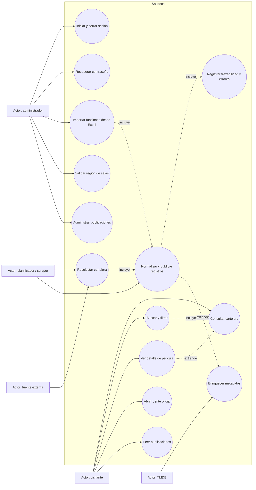
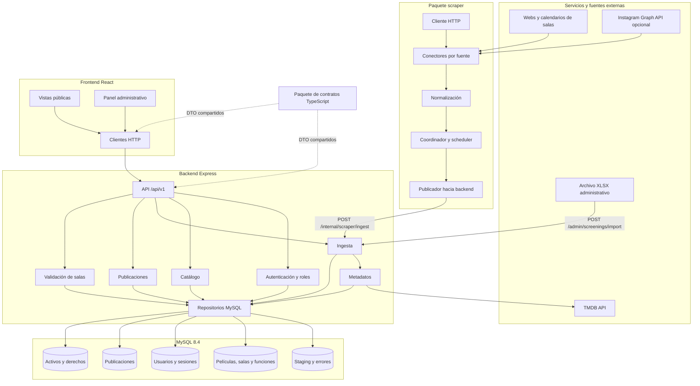
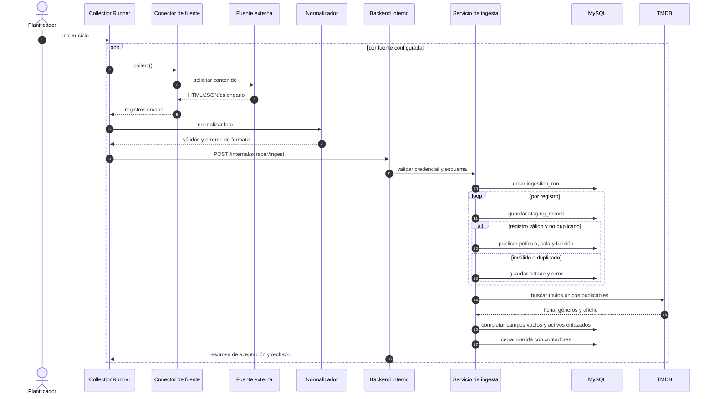
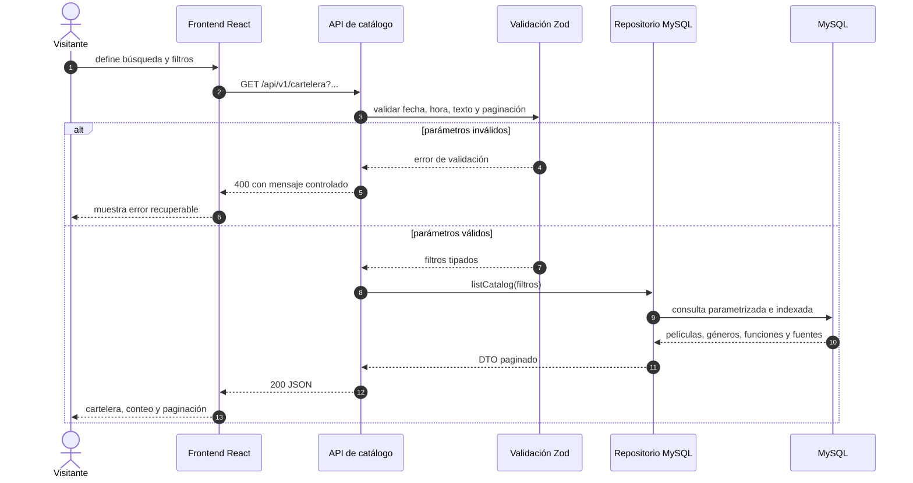
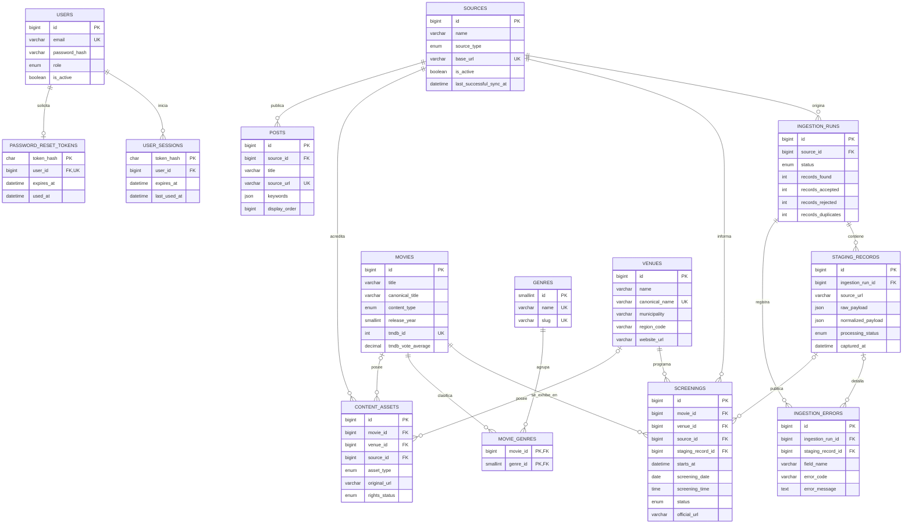
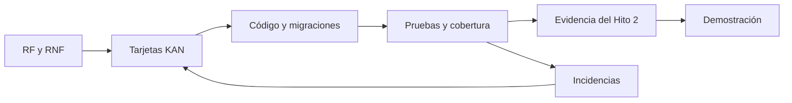

# Diagramas de soporte actualizados

Los diagramas representan el sistema implementado al commit `fbbb39b`. Sustituyen para este
hito las figuras conceptuales del informe inicial, que no incluyen autenticación, publicaciones,
staging completo ni enriquecimiento de metadatos.

## 1. Casos de uso del MVP

### Observación de alcance

El caso de uso “Administrar cartelera” del informe inicial se encuentra cubierto parcialmente:
la iteración permite importar funciones y validar salas, pero no ofrece CRUD completo de
películas, salas y funciones.

## 2. Diagrama de componentes

## 3. Secuencia de ingesta automatizada

## 4. Secuencia de consulta pública

## 5. Modelo entidad-relación implementado

El diagrama resume las claves y relaciones centrales. Los campos completos y las restricciones
se conservan en `database/migrations` y `docs/data-dictionary.md`.

## 6. Relación entre artefactos

